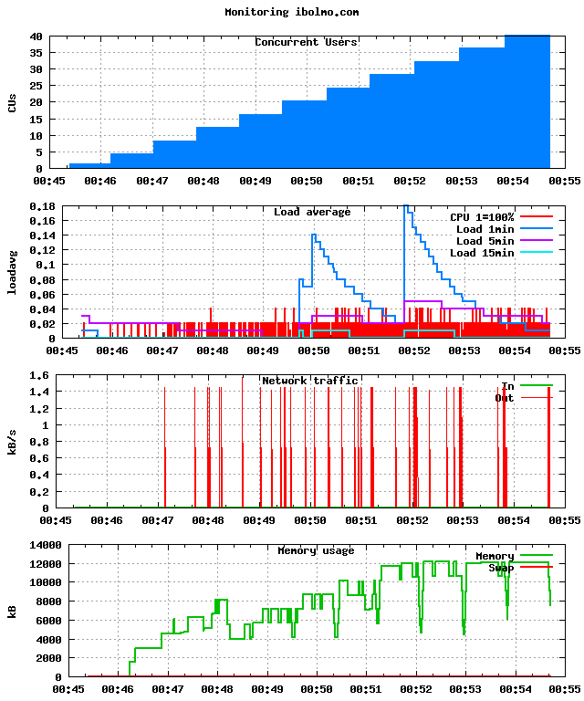

======================
FunkLoad_ bench report
======================

:date: 2009-05-25 01:15:54
:abstract: Loading a script with and without the use of Cametrics
           Bench result of ``UC1.test_uc1``: 
           Load a script with cametrics usage

.. _FunkLoad: http://funkload.nuxeo.org/
.. sectnum::    :depth: 2
.. contents:: Table of contents

Bench configuration
-------------------

* Launched: 2009-05-25 01:15:54
* Test: ``test_UC1.py UC1.test_uc1``
* Server: http://ibolmo.com/
* Cycles of concurrent users: [1, 4, 8, 12, 16, 20, 24, 28, 32, 36, 40]
* Cycle duration: 45s
* Sleeptime between request: from 0.0s to 0.5s
* Sleeptime between test case: 1.0s
* Startup delay between thread: 0.05s
* FunkLoad_ version: 1.10.1a-r53598

Bench content
-------------

The test ``UC1.test_uc1`` contains: 

* 1 page(s)
* 0 redirect(s)
* 0 link(s)
* 0 image(s)
* 0 XML RPC call(s)

The bench contains:

* 5865 tests
* 5864 pages
* 5864 requests

Test stats
----------

The number of Successful **Test** Per Second (STPS) over Concurrent Users (CUs).

 .. image:: tests.png

 ======= ======= ======= ======= =======
     CUs    STPS   TOTAL SUCCESS   ERROR
 ======= ======= ======= ======= =======
       1   0.578      26      26   0.00%
       4   2.356     106     106   0.00%
       8   4.756     214     214   0.00%
      12   6.956     313     313   0.00%
      16   9.378     422     422   0.00%
      20  11.889     535     535   0.00%
      24  13.956     628     628   0.00%
      28  16.667     750     750   0.00%
      32  18.911     851     851   0.00%
      36  21.267     957     957   0.00%
      40  23.622    1063    1063   0.00%
 ======= ======= ======= ======= =======

Page stats
----------

The number of Successful **Page** Per Second (SPPS) over Concurrent Users (CUs).
Note that an XML RPC call count like a page.

 .. image:: pages_spps.png
 .. image:: pages.png

 ======= ======= ======= ======= ======= ======= ======= ======= ======= ======= ======= ======= =======
     CUs    SPPS maxSPPS   TOTAL SUCCESS   ERROR     MIN     AVG     MAX     P10     MED     P90     P95
 ======= ======= ======= ======= ======= ======= ======= ======= ======= ======= ======= ======= =======
       1   0.578   1.000      26      26   0.00%   0.463   0.466   0.482   0.464   0.466   0.470   0.472
       4   2.378   4.000     107     107   0.00%   0.446   0.473   0.709   0.463   0.466   0.471   0.496
       8   4.778   8.000     215     215   0.00%   0.462   0.468   0.576   0.464   0.465   0.468   0.470
      12   6.956  10.000     313     313   0.00%   0.444   0.472   0.764   0.464   0.465   0.468   0.477
      16   9.378  15.000     422     422   0.00%   0.462   0.472   0.838   0.464   0.466   0.470   0.497
      20  11.867  16.000     534     534   0.00%   0.456   0.471   0.645   0.464   0.465   0.468   0.510
      24  13.911  17.000     626     626   0.00%   0.460   0.474   0.759   0.464   0.465   0.471   0.513
      28  16.644  21.000     749     749   0.00%   0.462   0.470   0.660   0.464   0.465   0.470   0.504
      32  18.978  22.000     854     854   0.00%   0.461   0.473   0.750   0.464   0.465   0.469   0.506
      36  21.244  24.000     956     956   0.00%   0.461   0.482   0.728   0.464   0.465   0.528   0.584
      40  23.600  26.000    1062    1062   0.00%   0.462   0.476   0.697   0.464   0.466   0.512   0.536
 ======= ======= ======= ======= ======= ======= ======= ======= ======= ======= ======= ======= =======

Request stats
-------------

The number of **Request** Per Second (RPS) successful or not over Concurrent Users (CUs).

 .. image:: requests_rps.png
 .. image:: requests.png

 ======= ======= ======= ======= ======= ======= ======= ======= ======= ======= ======= ======= =======
     CUs     RPS  maxRPS   TOTAL SUCCESS   ERROR     MIN     AVG     MAX     P10     MED     P90     P95
 ======= ======= ======= ======= ======= ======= ======= ======= ======= ======= ======= ======= =======
       1   0.578   1.000      26      26   0.00%   0.463   0.466   0.482   0.464   0.466   0.470   0.472
       4   2.378   4.000     107     107   0.00%   0.446   0.473   0.709   0.463   0.466   0.471   0.496
       8   4.778   8.000     215     215   0.00%   0.462   0.468   0.576   0.464   0.465   0.468   0.470
      12   6.956  10.000     313     313   0.00%   0.444   0.472   0.764   0.464   0.465   0.468   0.477
      16   9.378  15.000     422     422   0.00%   0.462   0.472   0.838   0.464   0.466   0.470   0.497
      20  11.867  16.000     534     534   0.00%   0.456   0.471   0.645   0.464   0.465   0.468   0.510
      24  13.911  17.000     626     626   0.00%   0.460   0.474   0.759   0.464   0.465   0.471   0.513
      28  16.644  21.000     749     749   0.00%   0.462   0.470   0.660   0.464   0.465   0.470   0.504
      32  18.978  22.000     854     854   0.00%   0.461   0.473   0.750   0.464   0.465   0.469   0.506
      36  21.244  24.000     956     956   0.00%   0.461   0.482   0.728   0.464   0.465   0.528   0.584
      40  23.600  26.000    1062    1062   0.00%   0.462   0.476   0.697   0.464   0.466   0.512   0.536
 ======= ======= ======= ======= ======= ======= ======= ======= ======= ======= ======= ======= =======

5 Slowest requests
------------------

Slowest average response time during the best cycle with **40** CUs:

* In page 001 post: //script.php took **0.476s**
  `POST to the script file`

Monitored hosts
---------------

ibolmo.com: The benched machine
~~~~~~~~~~~~~~~~~~~~~~~~~~~~~~~

Page detail stats
-----------------

PAGE 001: POST to the script file
~~~~~~~~~~~~~~~~~~~~~~~~~~~~~~~~~

* Req: 001, post, url //script.php

     .. image:: request_001.001.png

     ======= ======= ======= ======= ======= ======= ======= ======= ======= ======= =======
         CUs   TOTAL SUCCESS   ERROR     MIN     AVG     MAX     P10     MED     P90     P95
     ======= ======= ======= ======= ======= ======= ======= ======= ======= ======= =======
           1      26      26   0.00%   0.463   0.466   0.482   0.464   0.466   0.470   0.472
           4     107     107   0.00%   0.446   0.473   0.709   0.463   0.466   0.471   0.496
           8     215     215   0.00%   0.462   0.468   0.576   0.464   0.465   0.468   0.470
          12     313     313   0.00%   0.444   0.472   0.764   0.464   0.465   0.468   0.477
          16     422     422   0.00%   0.462   0.472   0.838   0.464   0.466   0.470   0.497
          20     534     534   0.00%   0.456   0.471   0.645   0.464   0.465   0.468   0.510
          24     626     626   0.00%   0.460   0.474   0.759   0.464   0.465   0.471   0.513
          28     749     749   0.00%   0.462   0.470   0.660   0.464   0.465   0.470   0.504
          32     854     854   0.00%   0.461   0.473   0.750   0.464   0.465   0.469   0.506
          36     956     956   0.00%   0.461   0.482   0.728   0.464   0.465   0.528   0.584
          40    1062    1062   0.00%   0.462   0.476   0.697   0.464   0.466   0.512   0.536
     ======= ======= ======= ======= ======= ======= ======= ======= ======= ======= =======

Definitions
-----------

* CUs: Concurrent users or number of concurrent threads executing tests.
* Request: a single GET/POST/redirect/xmlrpc request.
* Page: a request with redirects and ressource links (image, css, js) for an html page.
* STPS: Successful tests per second.
* SPPS: Successful pages per second.
* RPS: Requests per second successful or not.
* maxSPPS: Maximum SPPS during the cycle.
* maxRPS: Maximum RPS during the cycle.
* MIN: Minimum response time for a page or request.
* AVG: Average response time for a page or request.
* MAX: Maximmum response time for a page or request.
* P10: Percentil 10 or response time where 10 percent of pages or requests are delivred.
* MED: Median or Percentil 50, response time where half of pages or requests are delivred.
* P90: Percentil 90 or response time where 90 percent of pages or requests are delivred.
* P95: Percentil 95 or response time where 95 percent of pages or requests are delivred.

Report generated with FunkLoad_ 1.10.1a-r53598, more information available on the `FunkLoad site <http://funkload.nuxeo.org/#benching>`_.