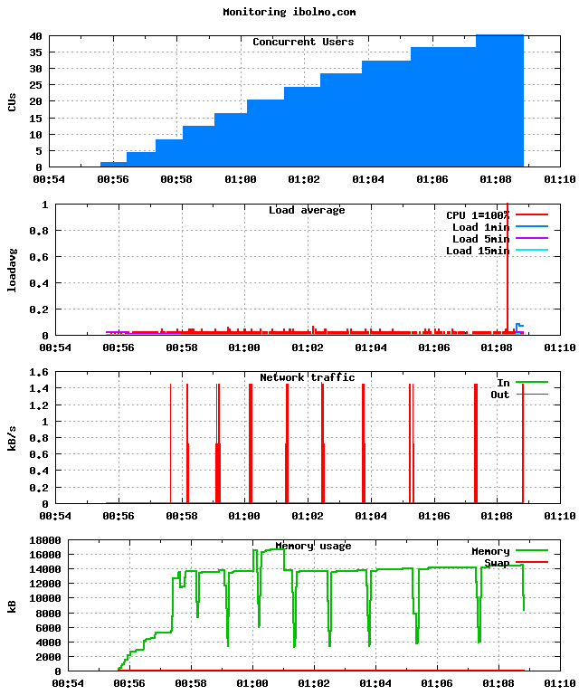

======================
FunkLoad_ bench report
======================

:date: 2009-05-25 01:26:09
:abstract: Loading a script with and without the use of Cametrics
           Bench result of ``UC1with.test_uc1``: 
           No test description

.. _FunkLoad: http://funkload.nuxeo.org/
.. sectnum::    :depth: 2
.. contents:: Table of contents

Bench configuration
-------------------

* Launched: 2009-05-25 01:26:09
* Test: ``test_UC1with.py UC1with.test_uc1``
* Server: http://ibolmo.com/
* Cycles of concurrent users: [1, 4, 8, 12, 16, 20, 24, 28, 32, 36, 40]
* Cycle duration: 45s
* Sleeptime between request: from 0.0s to 0.5s
* Sleeptime between test case: 1.0s
* Startup delay between thread: 0.05s
* FunkLoad_ version: 1.10.1a-r53598

Bench content
-------------

The test ``UC1with.test_uc1`` contains: 

* 1 page(s)
* 0 redirect(s)
* 0 link(s)
* 0 image(s)
* 0 XML RPC call(s)

The bench contains:

* 345 tests
* 345 pages
* 345 requests

Test stats
----------

The number of Successful **Test** Per Second (STPS) over Concurrent Users (CUs).

 .. image:: tests.png

 ======= ======= ======= ======= =======
     CUs    STPS   TOTAL SUCCESS   ERROR
 ======= ======= ======= ======= =======
       1   0.156       7       7   0.00%
       4   0.533      24      24   0.00%
       8   0.822      37      37   0.00%
      12   1.244      56      56   0.00%
      16   1.022      46      46   0.00%
      20   0.844      38      38   0.00%
      24   0.911      41      41   0.00%
      28   0.667      30      30   0.00%
      32   0.667      30      30   0.00%
      36   0.356      16      16   0.00%
      40   0.444      20      20   0.00%
 ======= ======= ======= ======= =======

Page stats
----------

The number of Successful **Page** Per Second (SPPS) over Concurrent Users (CUs).
Note that an XML RPC call count like a page.

 .. image:: pages_spps.png
 .. image:: pages.png

 ======= ======= ======= ======= ======= ======= ======= ======= ======= ======= ======= ======= =======
     CUs    SPPS maxSPPS   TOTAL SUCCESS   ERROR     MIN     AVG     MAX     P10     MED     P90     P95
 ======= ======= ======= ======= ======= ======= ======= ======= ======= ======= ======= ======= =======
       1   0.156   1.000       7       7   0.00%   4.003   4.735   6.099   4.003   4.545   6.099   6.099
       4   0.533   4.000      24      24   0.00%   4.624   5.859   9.525   4.669   5.271   9.137   9.233
       8   0.822   8.000      37      37   0.00%   5.066   8.270  20.394   5.263   6.115  15.863  18.467
      12   1.244   8.000      56      56   0.00%   5.571   8.027  12.636   6.286   8.004   9.065  11.060
      16   1.022  12.000      46      46   0.00%   6.104  12.015  17.441   6.989  12.139  16.183  16.556
      20   0.844  15.000      38      38   0.00%   8.092  17.765  25.234   8.391  18.926  24.423  24.770
      24   0.911  19.000      41      41   0.00%   6.562  16.708  24.328   7.131  18.297  23.453  23.589
      28   0.667  19.000      30      30   0.00%  10.574  25.581  39.861  11.294  27.263  39.339  39.664
      32   0.667  17.000      30      30   0.00%  11.311  25.095  40.238  11.887  24.804  38.583  38.738
      36   0.356  16.000      16      16   0.00%  19.746  30.399  46.777  20.213  23.443  46.053  46.777
      40   0.444  12.000      20      20   0.00%  15.919  25.565  35.268  16.707  30.655  34.823  35.268
 ======= ======= ======= ======= ======= ======= ======= ======= ======= ======= ======= ======= =======

Request stats
-------------

The number of **Request** Per Second (RPS) successful or not over Concurrent Users (CUs).

 .. image:: requests_rps.png
 .. image:: requests.png

 ======= ======= ======= ======= ======= ======= ======= ======= ======= ======= ======= ======= =======
     CUs     RPS  maxRPS   TOTAL SUCCESS   ERROR     MIN     AVG     MAX     P10     MED     P90     P95
 ======= ======= ======= ======= ======= ======= ======= ======= ======= ======= ======= ======= =======
       1   0.156   1.000       7       7   0.00%   4.003   4.735   6.099   4.003   4.545   6.099   6.099
       4   0.533   4.000      24      24   0.00%   4.624   5.859   9.525   4.669   5.271   9.137   9.233
       8   0.822   8.000      37      37   0.00%   5.066   8.270  20.394   5.263   6.115  15.863  18.467
      12   1.244   8.000      56      56   0.00%   5.571   8.027  12.636   6.286   8.004   9.065  11.060
      16   1.022  12.000      46      46   0.00%   6.104  12.015  17.441   6.989  12.139  16.183  16.556
      20   0.844  15.000      38      38   0.00%   8.092  17.765  25.234   8.391  18.926  24.423  24.770
      24   0.911  19.000      41      41   0.00%   6.562  16.708  24.328   7.131  18.297  23.453  23.589
      28   0.667  19.000      30      30   0.00%  10.574  25.581  39.861  11.294  27.263  39.339  39.664
      32   0.667  17.000      30      30   0.00%  11.311  25.095  40.238  11.887  24.804  38.583  38.738
      36   0.356  16.000      16      16   0.00%  19.746  30.399  46.777  20.213  23.443  46.053  46.777
      40   0.444  12.000      20      20   0.00%  15.919  25.565  35.268  16.707  30.655  34.823  35.268
 ======= ======= ======= ======= ======= ======= ======= ======= ======= ======= ======= ======= =======

5 Slowest requests
------------------

Slowest average response time during the best cycle with **12** CUs:

* In page 001 post: //script.php took **8.027s**
  `POST to the script file using cametrics`

Monitored hosts
---------------

ibolmo.com: The benched machine
~~~~~~~~~~~~~~~~~~~~~~~~~~~~~~~

Page detail stats
-----------------

PAGE 001: POST to the script file using cametrics
~~~~~~~~~~~~~~~~~~~~~~~~~~~~~~~~~~~~~~~~~~~~~~~~~

* Req: 001, post, url //script.php

     .. image:: request_001.001.png

     ======= ======= ======= ======= ======= ======= ======= ======= ======= ======= =======
         CUs   TOTAL SUCCESS   ERROR     MIN     AVG     MAX     P10     MED     P90     P95
     ======= ======= ======= ======= ======= ======= ======= ======= ======= ======= =======
           1       7       7   0.00%   4.003   4.735   6.099   4.003   4.545   6.099   6.099
           4      24      24   0.00%   4.624   5.859   9.525   4.669   5.271   9.137   9.233
           8      37      37   0.00%   5.066   8.270  20.394   5.263   6.115  15.863  18.467
          12      56      56   0.00%   5.571   8.027  12.636   6.286   8.004   9.065  11.060
          16      46      46   0.00%   6.104  12.015  17.441   6.989  12.139  16.183  16.556
          20      38      38   0.00%   8.092  17.765  25.234   8.391  18.926  24.423  24.770
          24      41      41   0.00%   6.562  16.708  24.328   7.131  18.297  23.453  23.589
          28      30      30   0.00%  10.574  25.581  39.861  11.294  27.263  39.339  39.664
          32      30      30   0.00%  11.311  25.095  40.238  11.887  24.804  38.583  38.738
          36      16      16   0.00%  19.746  30.399  46.777  20.213  23.443  46.053  46.777
          40      20      20   0.00%  15.919  25.565  35.268  16.707  30.655  34.823  35.268
     ======= ======= ======= ======= ======= ======= ======= ======= ======= ======= =======

Definitions
-----------

* CUs: Concurrent users or number of concurrent threads executing tests.
* Request: a single GET/POST/redirect/xmlrpc request.
* Page: a request with redirects and ressource links (image, css, js) for an html page.
* STPS: Successful tests per second.
* SPPS: Successful pages per second.
* RPS: Requests per second successful or not.
* maxSPPS: Maximum SPPS during the cycle.
* maxRPS: Maximum RPS during the cycle.
* MIN: Minimum response time for a page or request.
* AVG: Average response time for a page or request.
* MAX: Maximmum response time for a page or request.
* P10: Percentil 10 or response time where 10 percent of pages or requests are delivred.
* MED: Median or Percentil 50, response time where half of pages or requests are delivred.
* P90: Percentil 90 or response time where 90 percent of pages or requests are delivred.
* P95: Percentil 95 or response time where 95 percent of pages or requests are delivred.

Report generated with FunkLoad_ 1.10.1a-r53598, more information available on the `FunkLoad site <http://funkload.nuxeo.org/#benching>`_.